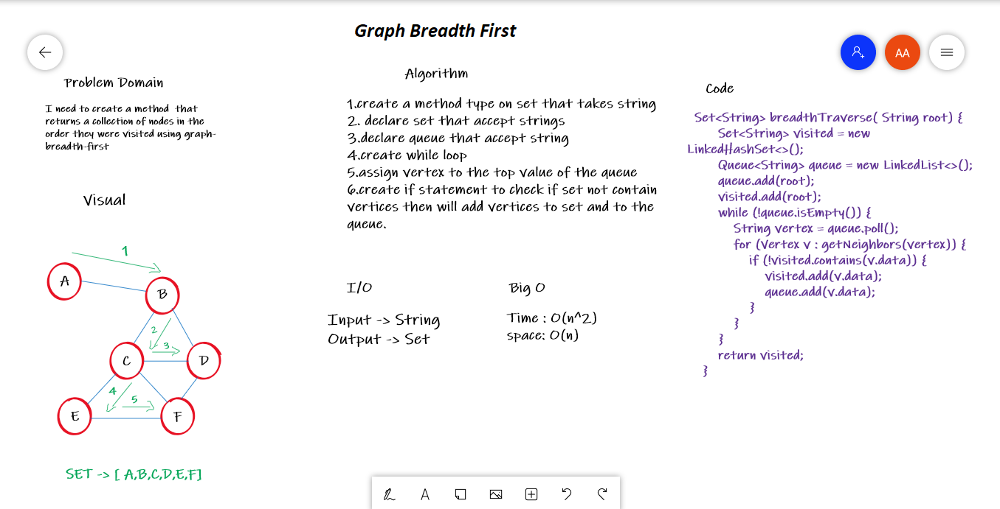
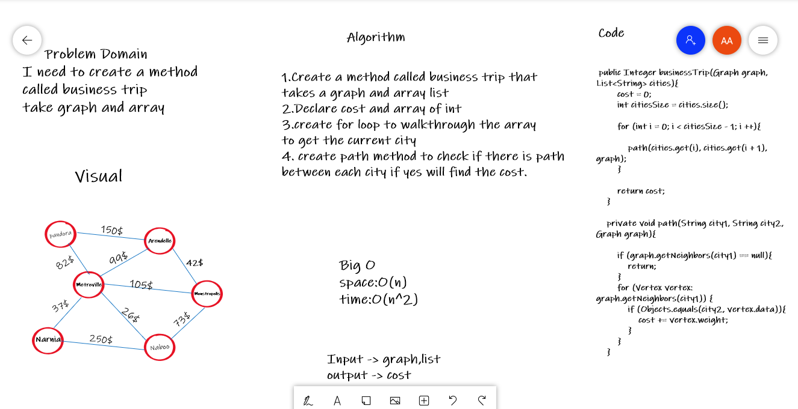
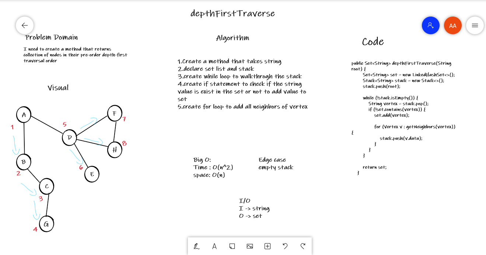

# Graphs
A Graph in the data structure can be termed as a data structure consisting of data that is stored among many groups of edges(paths) and vertices (nodes), which are interconnected. Graph data structure (N, E) is structured with a collection of Nodes and Edges. Both nodes and vertices need to be finite.

## Challenge
Implement the Graph. The graph should be represented as an adjacency list.

## White Board
Code challenge 36:

Code challenge 37:

Code challenge 38:

## Approach & Efficiency
addVertex(): it is O(1) for both time and space complexity.

addEdge(): it is O(1) for both time and space complexity.

neighbors(): it is O(n) for both time complexity and space complexity.

size(): it is O(n) for time complexity and O(1) for space complexity.

## API
addVertex(): to add vertex.

addEdge(): to connect each vertex together.

removeVertex(): remove the vertex.

removeEdge(): remove the relation.

neighbors(): Returns a collection of edges connected to the given node Include the weight of the connection in the returned collection

size(): Returns the total number of nodes in the graph.

breadthTraverse(): Return a set of nodes in the order they were visited.

depthFirstTraverse: Return a set of nodes in their pre-order depth-first traversal order.