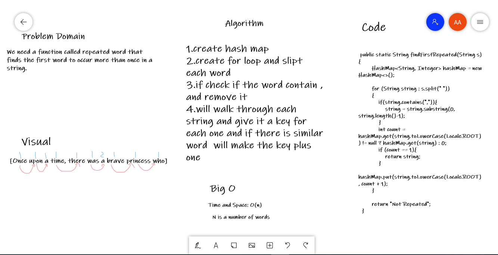
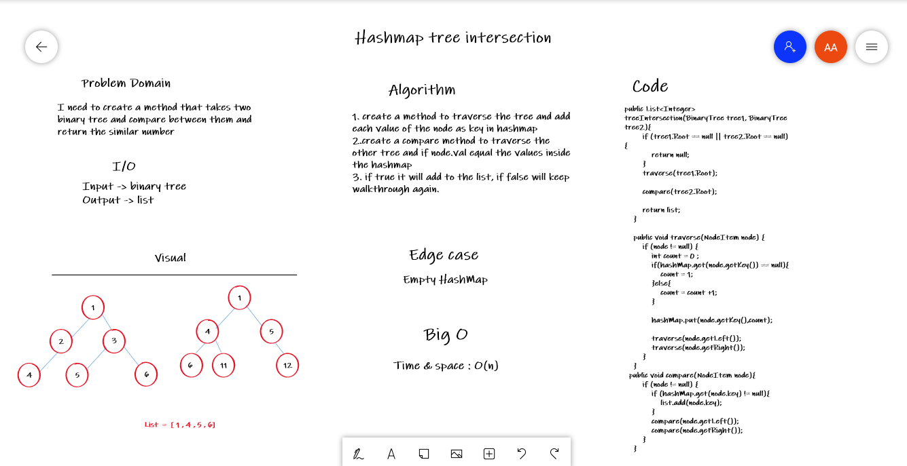
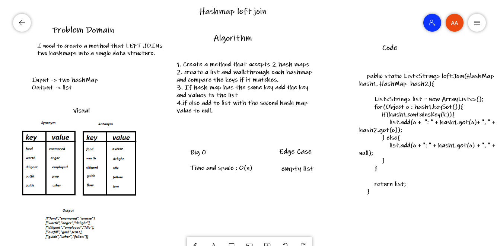

# Hashtables
A hash table (hash map) is a data structure that implements an associative array abstract data type, a structure that can map keys to values.
A hash table uses a hash function to compute an index, also called a hash code, into an array of buckets or slots, from which the desired value can be found.

## Challenge
Implement a Hashtable Class with the following methods add(), get(), contains() and hash()

## Whiteboard
Lab 31:

Lab 32:

Lab 33:

## Approach & Efficiency
Lab 31 :Big O(n) time and space because will walk through each element in linked list 

Lab 32 : Big O(n) time and space because there is recursion

Lab 33 : Big O(n) time and space because keep looping 

## API
add()-> to add to list

get()-> to get the index 

contains()-> returns Boolean indicating if the key exists in the table already.

hash()-> returns Index in the collection for that key

findFirstRepeated()-> returns the first repeated word

treeIntersection()-> compare two binary tree and find the similar nodes

leftJoin()-> LEFT JOINs accept two hashmaps into a single list

# Hashtables
A hash table (hash map) is a data structure that implements an associative array abstract data type, a structure that can map keys to values.
A hash table uses a hash function to compute an index, also called a hash code, into an array of buckets or slots, from which the desired value can be found.

## Challenge
Implement a Hashtable Class with the following methods add(), get(), contains() and hash()

## Whiteboard
Lab 31:

Lab 32:

Lab 33:

## Approach & Efficiency
Lab 31 :Big O(n) time and space because will walk through each element in linked list 

Lab 32 : Big O(n) time and space because there is recursion

Lab 33 : Big O(n) time and space because keep looping 

## API
add()-> to add to list

get()-> to get the index 

contains()-> returns Boolean indicating if the key exists in the table already.

hash()-> returns Index in the collection for that key

findFirstRepeated()-> returns the first repeated word

treeIntersection()-> compare two binary tree and find the similar nodes

leftJoin()-> LEFT JOINs accept two hashmaps into a single list
treeIntersection()-> compare two binary tree and find the similar nodes

