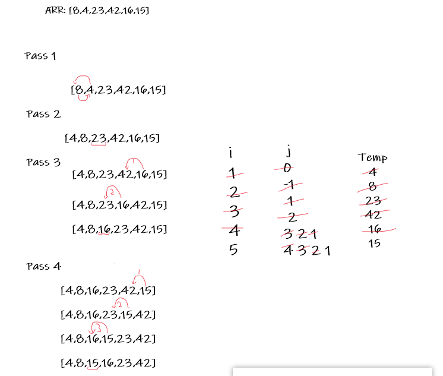

# Insertion Sort
> Insertion sort is a simple sorting algorithm that works similar to the way you sort playing cards in your hands.


# Pseudocode
```
InsertionSort(int[] arr)

    FOR i = 1 to arr.length

      int j <-- i - 1
      int temp <-- arr[i]

      WHILE j >= 0 AND temp < arr[j]
        arr[j + 1] <-- arr[j]
        j <-- j - 1

      arr[j + 1] <-- temp

```

# Trace




## Efficency
Time : O(n^2)
Space: O(1)
Insertion sort takes maximum time to sort if elements are sorted in reverse order. And it takes minimum time (Order of n) when elements are already sorted.