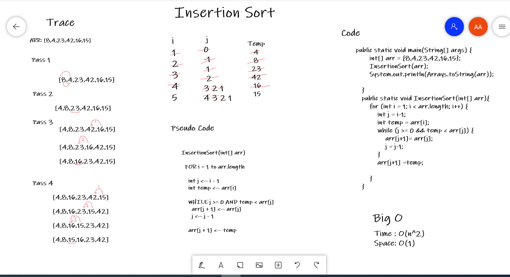

# Sort
A Sorting Algorithm is used to rearrange a given array or list elements according to a comparison operator on the elements. The comparison operator is used to decide the new order of element in the respective data structure.
## Whiteboard Process
Lab 26:

Lab 27:

## Approach & Efficiency
 > code challenge 26  
   Time : O(n^2)  
   Space: O(1)  
   Insertion sort takes maximum time to sort if elements are sorted in reverse order. And it takes minimum time (Order of n) when elements are already sorted.
 
 > code challenge 26  
   time: O(logn) 
   Space: O(n)
 

