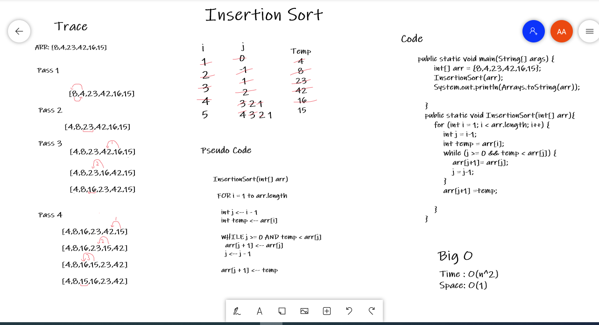

# Insertion Sort
Insertion sort is a simple sorting algorithm that builds the final sorted array one item at a time.

## Whiteboard Process

## Approach & Efficiency
 > code challenge 26  
   Time : O(n^2)  
   Space: O(1)  
   Insertion sort takes maximum time to sort if elements are sorted in reverse order. And it takes minimum time (Order of n) when elements are already sorted.
## Solution
 > [4, 8, 15, 16, 23, 42]
