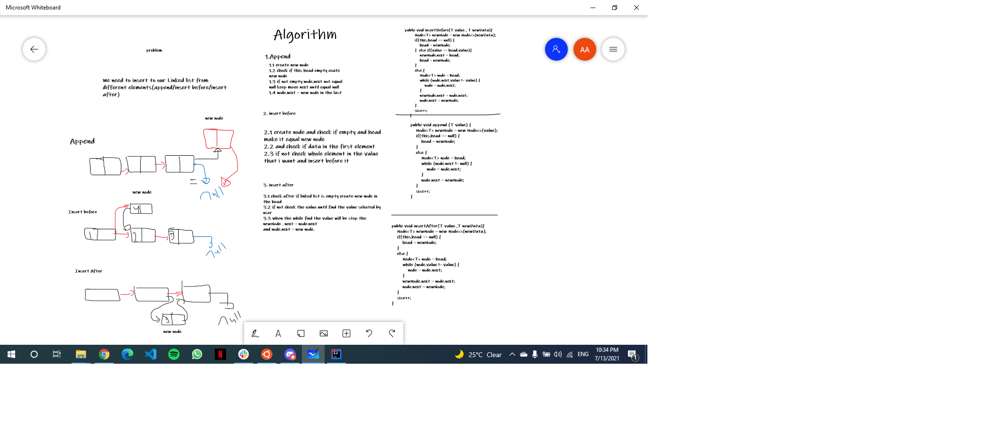
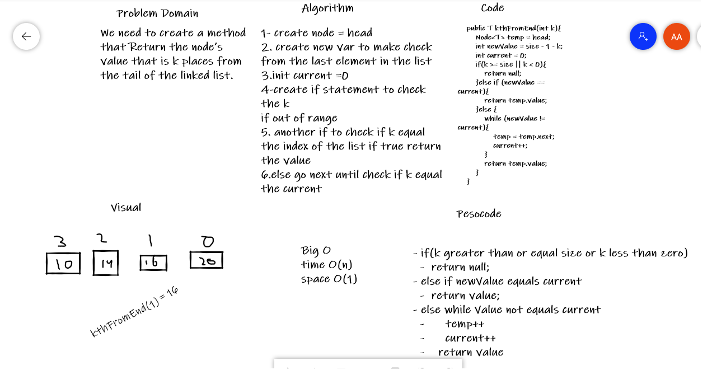

# Singly Linked List
Singly linked list can be defined as the collection of ordered set of elements.

## Challenge
Challenge 5 about create linked list and how to insert elements in list and searching if the element inside the list  
Challenge 6 create 3 methods first method we need to add new to the end of the list the second method to insert before specific element and the last method for insert after specific element.

## Approach & Efficiency
 Linked list insertion : time O(1) / space : O(n)
 Linked list insertion : time O(n) / space : O(1)
## whiteboard
Code challenge 6:

Code challenge 7:

Insert(): to insert nw node in the list.
Search(): to check if the element inside the list.
toString(): override method to returns a String representation.

append(): to add in the end of the list.
insertBefore(): to add before specific element.
insertAfter(): to add after specific element.

kthFromEnd(): search the index from the end of Linked List