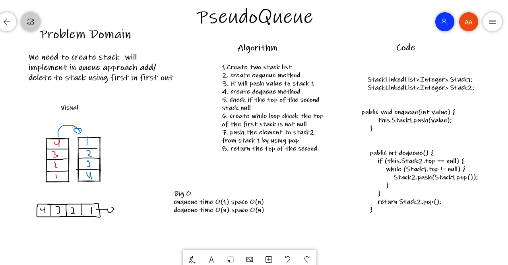
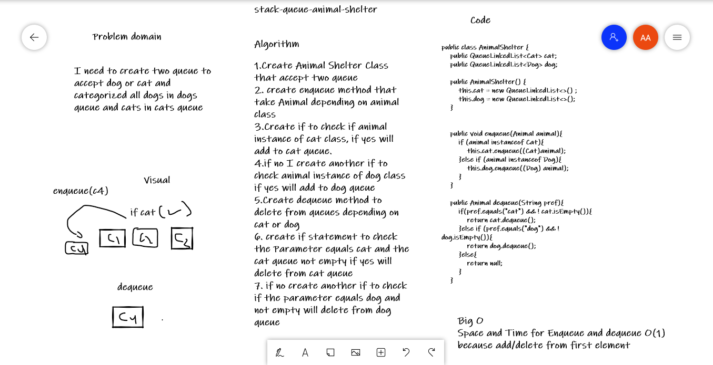
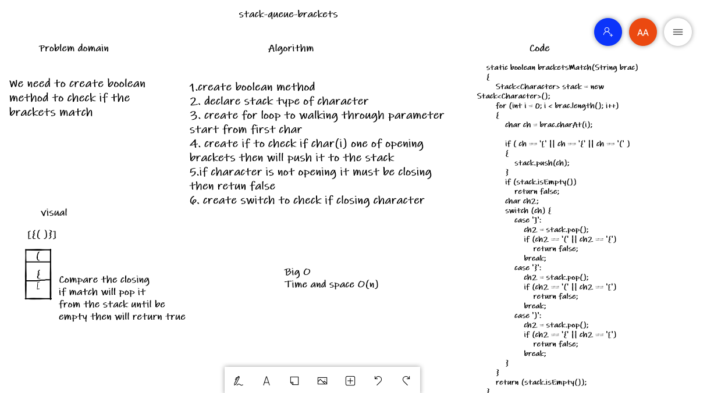

# Stacks and Queues
A stack is an abstract data type that holds an ordered, linear sequence of items.(First in last out)

A Queue is a linear structure which follows a particular order in which the operations are performed.( First In First Out (FIFO))

## Challenge
In this code challenge we need to create some methods that help to create stack and queue
and add elements to them or delete elements

## Approach & Efficiency
Stack Space and time O(1), We always have a pointer to the top element, we add or delete from top.

Queue Space and time O(1), We usually have a pointer to the first and last element of the queue.

PseudoQueue : 
Enqueue :
time and space complexity are both O(1) because we add only one element in the top of stack

Dequeue : time and space complexity are  O(n) because transfering all items from first stack to second stack.

Animal Shelter :

Space and Time for Enqueue and dequeue O(1)
because add/delete from first element

Brackets :

Space and Time O(n) because we have for loop to check each element 

## White boards
PseudoQueue:

Animal shelter:

Brackets :

## API
Stack Class:

push():add elements to stack.

pop():delete elements from stack.

peek():return the top element in stack.

isEmpty():check if stack empty.

  
Queue Class:

enqueue():add elements to Queue.

dequeue():delete elements from Queue.

peek():return the top element in Queue.

isEmpty():check if Queue empty.

pseudoQueue class:

enqueue(): push to stack

dequeue(): delete the top elements in stack

Animal Shelter class:

enqueue(): push to queue depending on cats or dogs

dequeue(): delete first elements from queue

Brackets class :

bracketsMatch(): boolean method to check if stack empty of brackets or not

resources geeksforgeeks.org